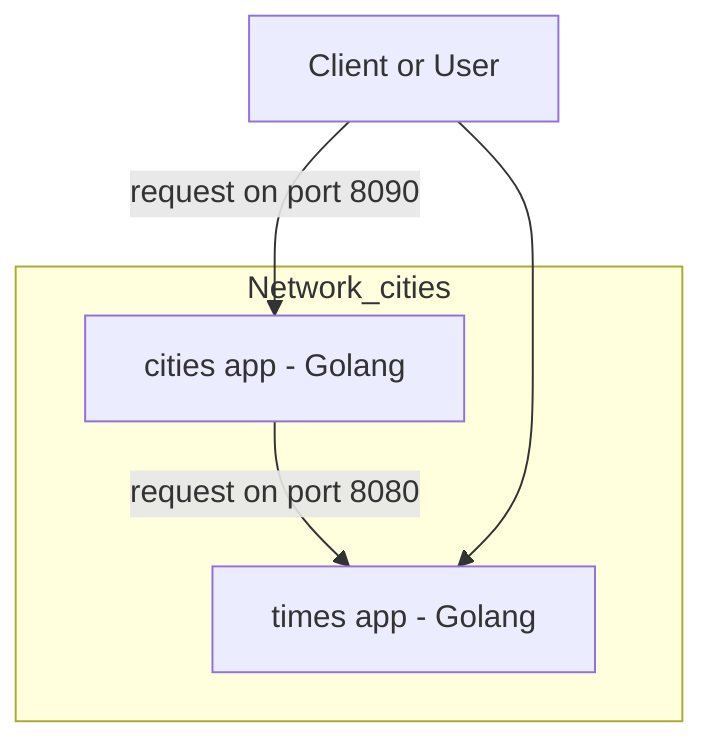

# Architecture: Microservices with Podman Networking

This document describes a simple architecture with two Golang-based microservices using Podman networking.

---

## 🧩 Overview

There are two microservices that communicate within a Podman network named **`cities`**:

### 1. `times app`
- Written in Go.
- Provides the **current time for a given city**.
- Runs inside the Podman network called `cities`.

### 2. `cities app`
- Also written in Go.
- Provides **information about a city**, such as name, country, population, etc.
- It internally queries `times app` to include the **current time** in its response.
- Also runs inside the `cities` network.

---

## 🔁 Communication Flow

- A **client (e.g., browser or REST client)** can access both services (`cities app` and `times app`).
- The `cities app` acts as a frontend, and internally makes an HTTP request to the `times app` to enrich its data.

---

## 📊 Network Diagram (Mermaid)

---

## ✅ Summary

- Both services are connected to the **same Podman network**, allowing internal communication by service name.
- This architecture illustrates a **common microservice pattern**, where one service aggregates data from another before responding to the client.
